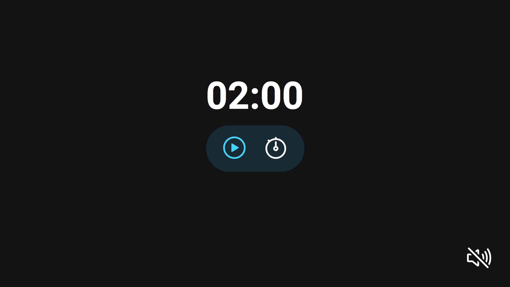

# Stage 5 - Focus Timer

>Curso Explorer

Projeto construído no curso Explorer da Rocketseat. Trata-se de um cronometro com estilo pomodoro.

[ 🔗 Clique aqui para acessar](https://ricardojcosta.github.io/explorer5-focustime/)

## ⚒ Tecnologias

  - HTML 
  - CSS 
  - JS 
  - Git e Github

## ✉ Contato

ricardoredes2006@gmail.com